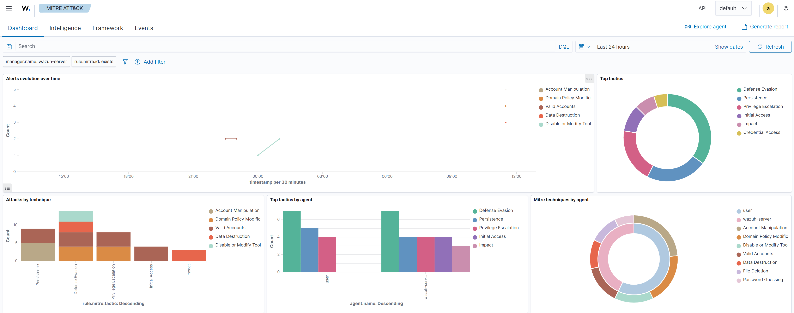

# Wazuh & Sysmon SOC Monitoring Lab

This project demonstrates the deployment of a small SOC monitoring environment using Wazuh SIEM and Microsoft Sysmon.

The lab consists of a Wazuh Manager running in an Ubuntu virtual machine and a Windows endpoint running the Wazuh Agent and Sysmon.

The objective is to practice Windows telemetry collection, security event monitoring, alert investigation, and MITRE ATT&CK mapping in an isolated virtual environment.

---

 Architecture

The lab consists of:

- **SIEM:** Wazuh Manager running in an Ubuntu VM using Oracle VirtualBox
- **Endpoint:** Windows 11 host
- **Endpoint Monitoring:** Microsoft Sysmon
- **Log Collection:** Wazuh Agent
- **Telemetry Source:** Windows Event Logs / Sysmon Operational channel
- **Detection:** Wazuh rules and alerts
- **Framework:** MITRE ATT&CK

---
Implementation
Phase 1 — Virtual Infrastructure
Deployed the official Wazuh virtual appliance using Oracle VirtualBox.
Configured the Wazuh Manager in an Ubuntu-based virtual environment.
Connected the Windows endpoint to the Wazuh Manager through the virtual lab network.

Phase 2 — Sysmon
Installed Microsoft Sysmon on the Windows endpoint.
Applied the SwiftOnSecurity Sysmon configuration to reduce unnecessary telemetry and focus on security-relevant events.
Enabled Sysmon using:
.\Sysmon64.exe -i sysmonconfig.xml -accepteula

Phase 3 — Wazuh Agent Integration
Configured the Wazuh Agent to collect Sysmon Operational events:
<localfile>
  <location>Microsoft-Windows-Sysmon/Operational</location>
  <log_format>eventchannel</log_format>
</localfile>
Restarted the Wazuh Agent and verified that Sysmon events were being received by the Wazuh Manager.

---
Detection Validation
Simulated Discovery Activity

nltest /dclist:

This command was used to simulate domain-controller discovery activity and generate relevant process telemetry.

MITRE ATT&CK
Mapped the simulated activity to the relevant MITRE ATT&CK discovery technique based on the observed behavior and Wazuh rule.

Compliance Reference
The logging and monitoring capabilities were reviewed against relevant ISO/IEC 27002 logging controls and Dutch government BIO/BIO2 security requirements.

---
### The Lab 

### 1. Central Wazuh Control Center showing active Windows Node

### 2. Level 8 catching alert (`nltest` execution)

### 3. Power Shell instruction  

### 4. MITRE ATT&CK

