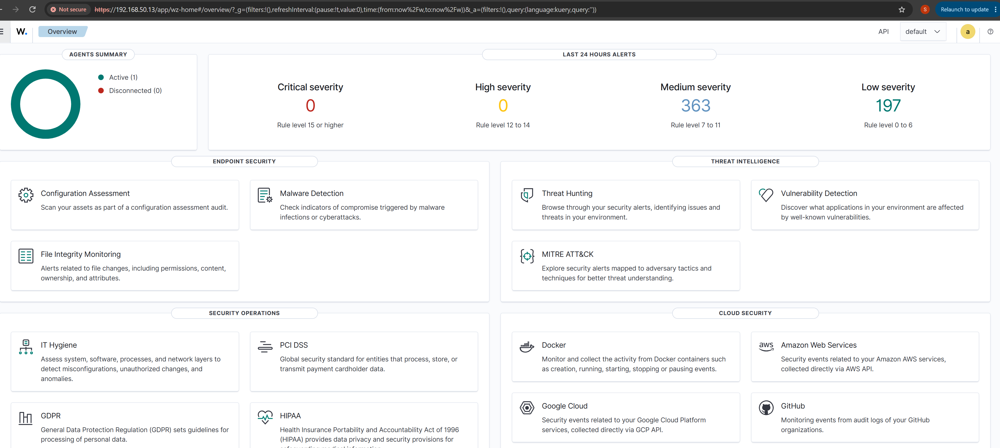
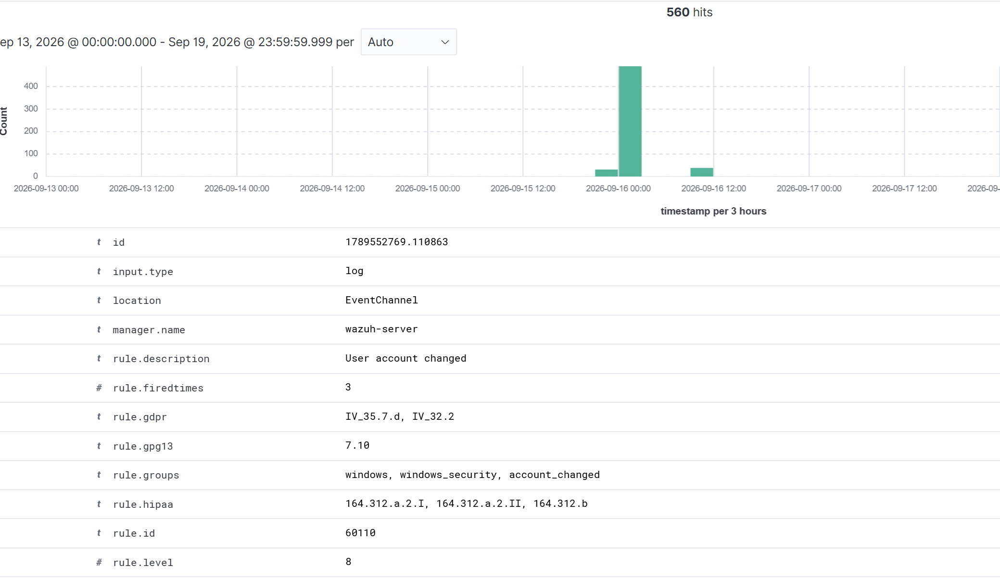
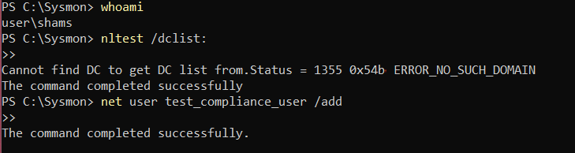

# wazuh-sysmon-compliance-lab
# Wazuh & Sysmon SOC Monitoring Lab

## 📌 Project Overview
This project demonstrates the deployment of a localized SIEM (Wazuh) and deep endpoint monitoring system (Microsoft Sysmon) inside an isolated virtual lab environment. The purpose of this lab is to simulate real-time log ingestion, threat detection, and correlation mapping to the Dutch **BIO2 (Baseline Informatiebeveiliging Overheid)** and **ISO/IEC 27001** compliance baselines.

---

## 🏗️ Architecture & Component Blueprint
The entire ecosystem runs on a single physical host laptop utilizing a localized network bridge:
- **SIEM Brain:** Wazuh Manager (v4.x) deployed inside an isolated Ubuntu Linux Virtual Machine (Oracle VirtualBox).
- **Endpoint Microscope:** Actual Windows Laptop Host environment utilizing **Microsoft Sysmon** providing detailed Windows process, network, file and system activity.
- **Noise Filter:** Community-standard **SwiftOnSecurity** XML configuration mapping rule sets Used to reduce unnecessary telemetry and focus monitoring on security-relevant events.
- **Log Pipeline:** Wazuh Windows Agent channeling events over a secure background session.

---

## 🛠️ Implementation Steps

### Phase 1: Virtual Infrastructure
1. Provisioned an isolated virtual environment via Oracle VirtualBox.
2. Allocated `4GB RAM` and `2 vCPUs` to the official Wazuh Virtual Appliance (OVA).

### Phase 2: Endpoint Kernel Auditing (Sysmon Setup)
1. Deployed Microsoft Sysmon directly into `C:\Sysmon`.
2. Loaded **SwiftOnSecurity’s** optimized configuration engine to suppress 95% of safe background noise and focus telemetry strictly on anomalies.
3. Successfully installed the kernel service using the terminal:
   ```powershell
   .\Sysmon64.exe -i sysmonconfig.xml -accepteula
   ```

### Phase 3: Telemetry Pipe Integration
1. Modified the internal client configuration file (`ossec.conf`) on the Windows host to look natively into the Sysmon event logs channel:
   ```xml
   <localfile>
     <location>Microsoft-Windows-Sysmon/Operational</location>
     <log_format>eventchannel</log_format>
   </localfile>
   ```
2. Initiated the connection using administrative PowerShell permissions (`Start-Service -Name Wazuh`).

---

## 🧪 Threat Hunting Validation & Compliance Mapping

To verify the operational integrity of the Security Operations Center (SOC) environment, Executed nltest /dclist: to generate Windows process telemetry associated with domain-controller discovery and validate the detection pipeline.


### The SIEM Result:
- **Detection Mechanics:** Sysmon immediately captured the suspicious process creation parameters.
- **Log Transport:** The Wazuh agent bundled the telemetry block and shot it over the virtual connection.
- **Manager Analysis:** The Wazuh correlation engine successfully matched the log against known adversarial behaviors, triggering a **Severity Alert (Level 8)**.
- **Audit Value:** The incident was automatically categorized under **ISO 27002 Control 8.15 (Logging)** and cross-referenced with the standard MITRE ATT&CK matrix.

---

## 📸 Lab Evidence
*(Pro-tip: Replace these placeholders below with screenshots from your laptop to prove you built it!)*

### 1. Central Wazuh Control Center showing active Windows Node



### 2. Level 8 catching the malicious `nltest` execution


### 3. Power Shell instruction  

